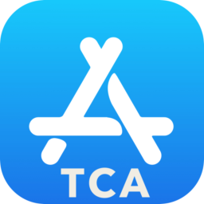
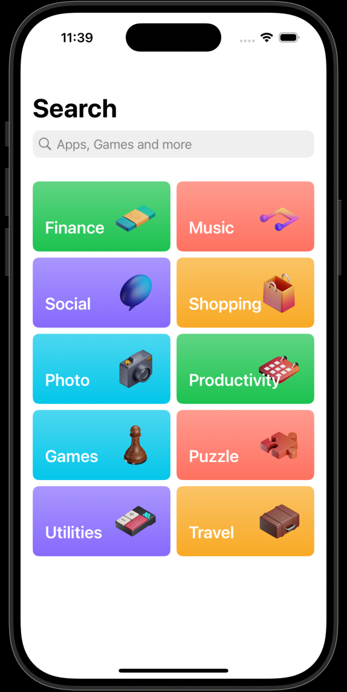
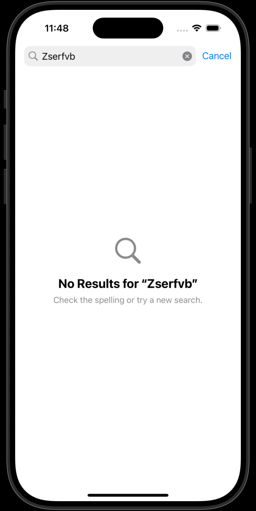
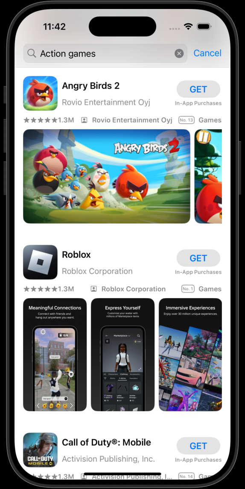
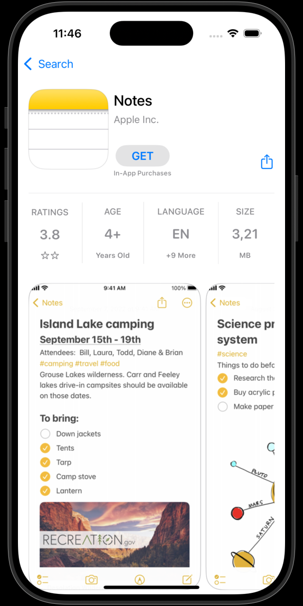
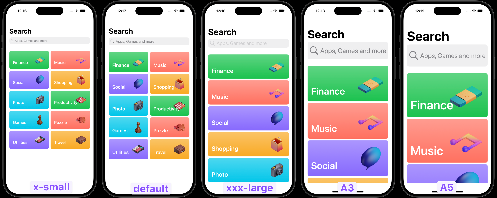
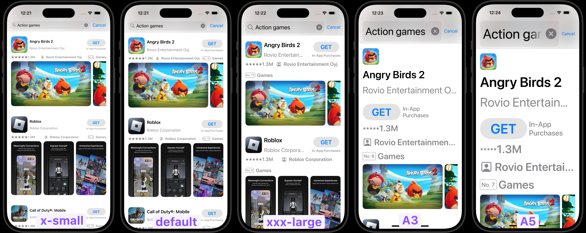
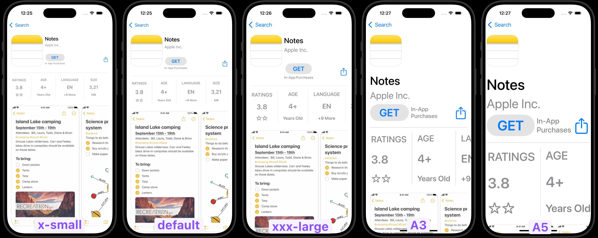

<h1> AppStoreTCA
  
</h1>

<p>
    
    
    
</p>

### AppStore App using The Composable Architecture
This is a sample iOS app built with SwiftUI and [The Composable Architecture](https://github.com/pointfreeco/swift-composable-architecture) by [Point-Free](https://www.pointfree.co)

<br>
<p>
    
    
    
    
</p>
<br>

## Features

- **Search**: Allows users to search for apps using iTunes API.
- **Navigation**: Navigate through the list of apps, view details,
- **Empty state and Error Handling**: Shows `ContentUnavailableView` in case of "No results" and `Alert` for Network errors.
- **Testing**: Demonstrates how to write unit tests for TCA-based components, ensuring that actions, state updates, and effects behave as expected.

## API

The app uses iTunes search API to search for apps and retrieve their details.

```
https://itunes.apple.com/search?term=Notes&country=us&media=software
```

## Accessibility

The user interface supports **Dynamic Type** to ensure the app is accessible to users with different font size preferences.

#### Screenshots 
<details>
  <summary>Search Screen</summary>
  
</details>
<details>
  <summary>Search Results Screen</summary>
  
</details>
<details>
  <summary>App Details Screen</summary>
  
</details>

## Setup

1. Clone this repository to your local machine.
2. Open the project in Xcode.
3. Run the app on the simulator or a physical device.

## Getting strated with TCA

If you want to learn more about TCA, Point-Free has released an interactive tutorial [Meet the Composable Architecture](https://pointfreeco.github.io/swift-composable-architecture/main/tutorials/meetcomposablearchitecture/)
